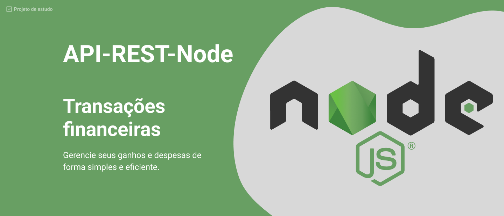

# 🌐 API REST Node



Esta é uma **API REST** construída em **Node.js** utilizando o framework **Fastify**. A API é destinada ao gerenciamento de transações financeiras, fornecendo funcionalidades para criação, consulta e listagem de transações. A API também utiliza o banco de dados **SQLite** para armazenar os dados e faz uso da biblioteca **Knex** para realizar as operações de banco de dados.

## ✨ Funcionalidades

A API oferece as seguintes funcionalidades:

- ✅ Criação de transações financeiras com os seguintes campos:
  - id: Identificador único da transação.
  - titulo: Título da transação.
  - tipo: Tipo da transação (crédito ou débito).
  - valor: Valor da transação.
- 📋 Listagem das transações do usuário.
- 🔍 Consulta de uma transação específica do usuário pelo seu ID.
- ✔️ Resumo da conta mostrando o saldo.


## 📋 Pré-requisitos

Antes de executar a API, certifique-se de ter o seguinte instalado em sua máquina:

- 🚀 Node.js (versão 18 ou superior)
- ⚙️ NPM (gerenciador de pacotes do Node.js)

## 🚀 Instalação

1. Clone este repositório em sua máquina local:

   ``` bash
   git clone https://github.com/gabrielvbauer/api-rest-node.git
   ```

2. Acesse o diretório do projeto:

    ``` bash
   cd api-rest-node
   ```

3. Instale as dependências do projeto usando o NPM:

    ``` bash
   npm install
   ```

4. Execute as migrations para criar as tabelas do banco de dados:

    ``` bash
   npx knex migrate:latest
   ```

## ⚙️ Configuração

Antes de iniciar a API, você deve configurar as variáveis de ambiente. Crie um arquivo `.env` na raiz do projeto de acordo com o `.env.example` e ajuste as variáveis de ambiente de acordo com suas configurações.

## ▶️ Uso

Após concluir as etapas de instalação e configuração, você pode iniciar a API executando o seguinte comando:

   ``` bash
   npm run dev
   ```

A API estará disponível no seguinte endereço: `http://localhost:3333`.

## 🛠️ Rotas

A API possui as seguintes rotas:

- ➕ `POST /transactions`: Cria uma nova transação.
- 🔍 `GET /transactions`: Lista todas as transações do usuário.
- 🔍 `GET /transactions/:id`: Visualiza uma transação específica.
- 📋 `GET /transactions/summary`: Obtém um resumo do saldo.

## 🛠️ Tecnologias Utilizadas

A API REST Node utiliza as seguintes tecnologias e bibliotecas:

- 🚀 **Node.js**: Plataforma de tempo de execução JavaScript que permite a construção de aplicações do lado do servidor usando JavaScript.
- ⚡ **Fastify**: Um framework web rápido e eficiente para criação de APIs em Node.js.
- 🗄️ **SQLite**: Um sistema de gerenciamento de banco de dados relacional leve e embutido, amplamente utilizado para aplicações de pequeno porte.
- 🛠️ **Knex**: Uma biblioteca SQL query builder para Node.js que facilita a interação com bancos de dados relacionais.
- ✅ **Zod**: Uma biblioteca de validação de esquemas em tempo de execução para JavaScript/TypeScript, utilizada para validar os dados das transações financeiras.

Essas tecnologias foram escolhidas para fornecer uma base sólida para o desenvolvimento da API, permitindo a construção de uma aplicação eficiente, segura e escalável.

## 📄 Licença

Este projeto está licenciado sob a licença [MIT](https://opensource.org/licenses/MIT).
